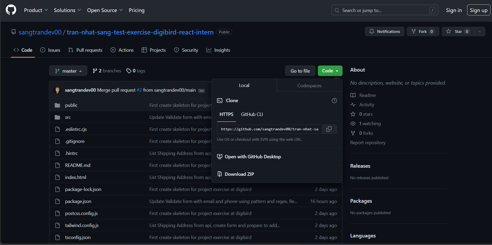
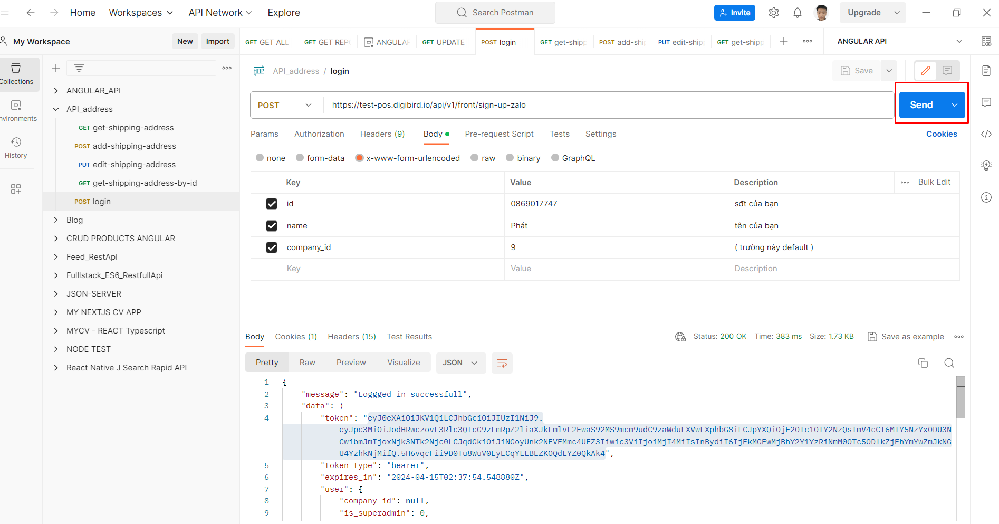
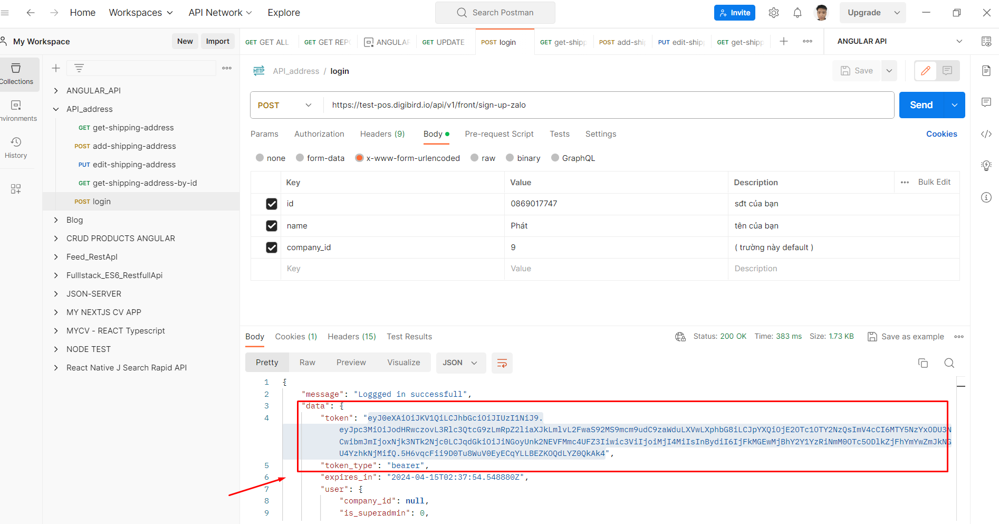
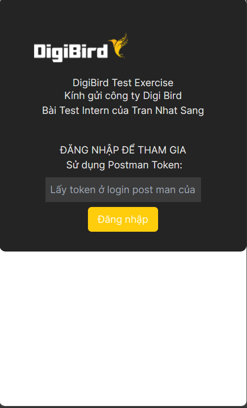
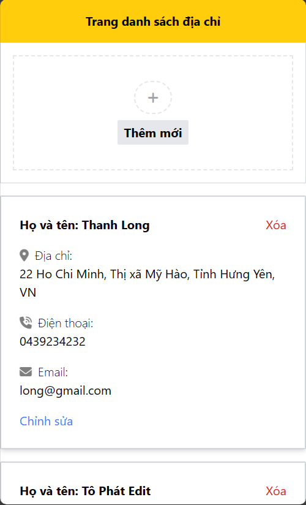
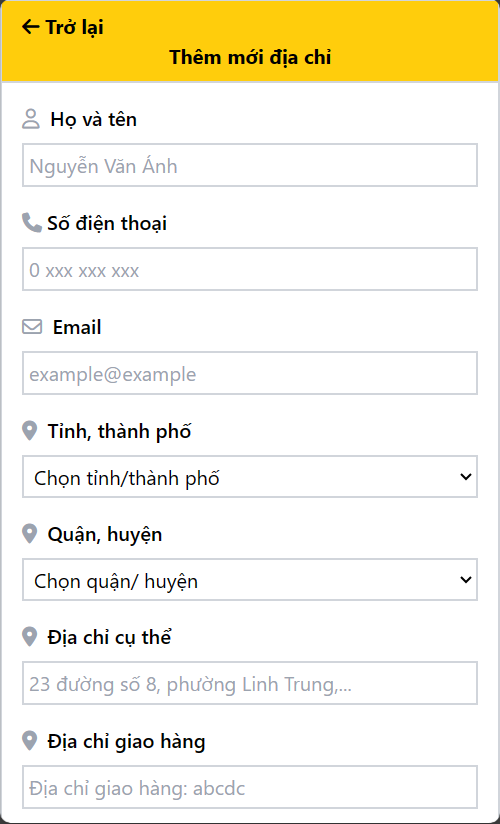
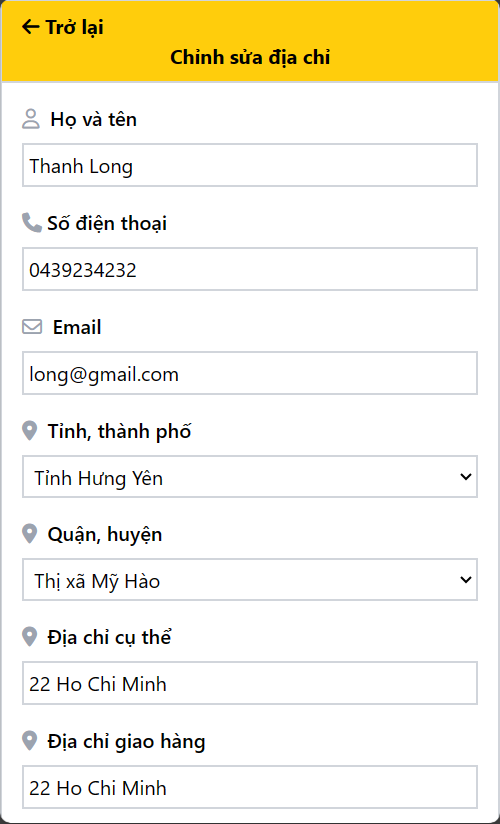

# Exercise Test Intern - Tran Nhat Sang - Cty DigiBird
Dear Didibird company. Here is my intern react test.

## How to use and run this test exercise ?

### Step 1: Clone the project via this github repo.
`git clone https://github.com/sangtrandev00/tran-nhat-sang-test-exercise-digibird-react-intern.git your-folder-name`

### Step 2: Run Command at current terminal
+ `cd your-folder-name`
+ `yarn`: Install package dependencies
+ `yarn dev`: Run on local development

### Step 3: Open postman service at your machine

+ Click Send request with POST LOGIN API
+ Copy Token at Reponse Body
  

### Step 4: Login to the test exercise with port localhost:8000
+ Past Token have copied at step 3 into input (token)

+ Click Button Login

### Step 5: Check the exercise
+ Address Page

  
+ Add Page

+ Edit Page 

  

## Technology in use:
TailwindCSS, React TypeScript, Recoil, React Hook Form, React Toastify

## Contact me every time!
+ email: nhatsang0101@gmail.com
+ phone: 0937988510
+ website: https://trannhatsang.com

## Thank you so much for sending me an email for this test!

I wish I can join your company as a good employee!